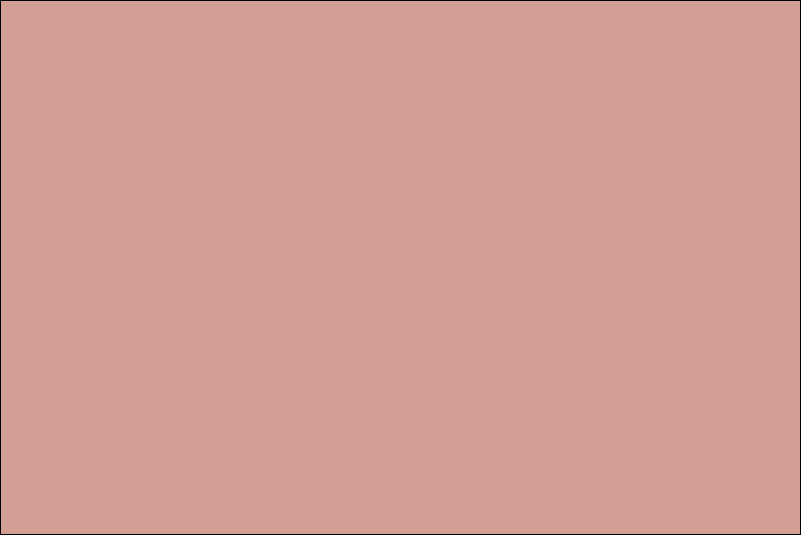
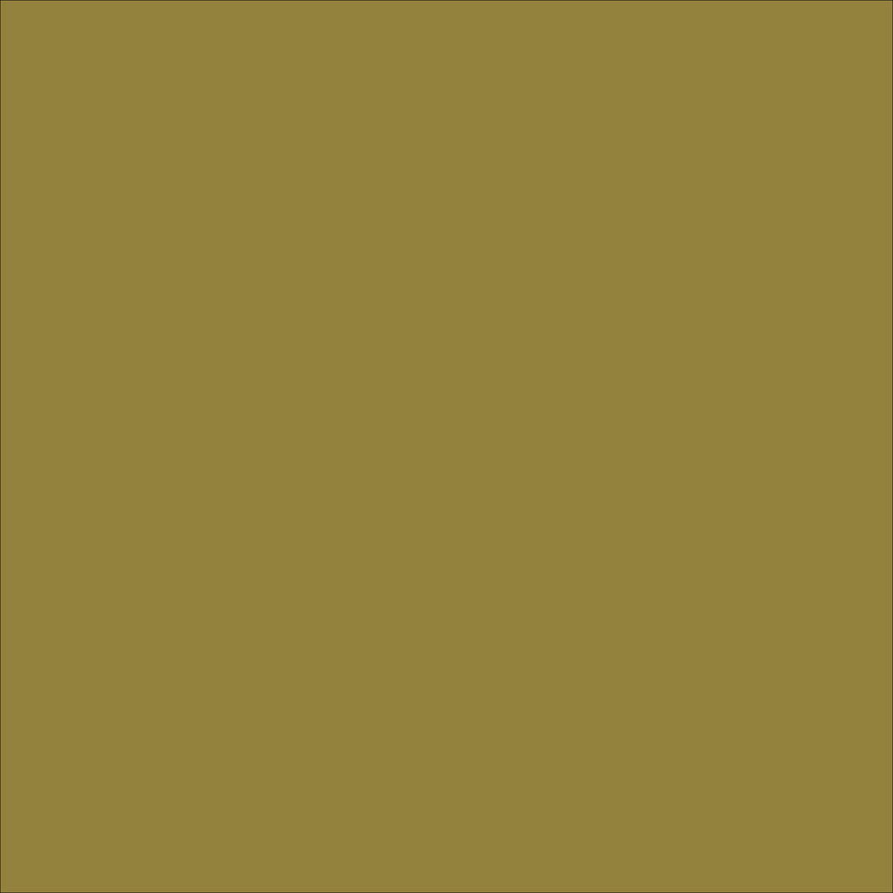
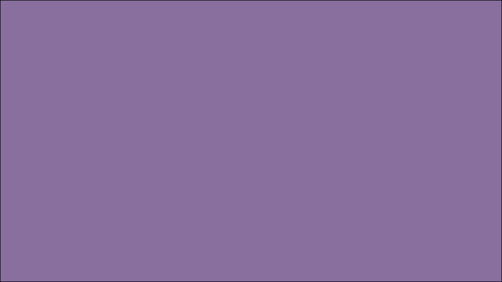

## Quads
This project forked from [Quads](https://github.com/fogleman/Quads).

Computer art based on quadtrees.

The program targets an input image. The input image is split into four quadrants. Each quadrant is assigned an averaged color based on the colors in the input image. The quadrant with the largest error is split into its four children quadrants to refine the image. This process is repeated N times.

### Animation

The first animation shows the natural iterative process of the algorithm.

The second animation shows a top-down, breadth-first traversal of the final quadtree.

### Samples

### change logs
#### v1.1.0
* support python 3 
* add gif generate script `gen_gif.py`.

20.6
